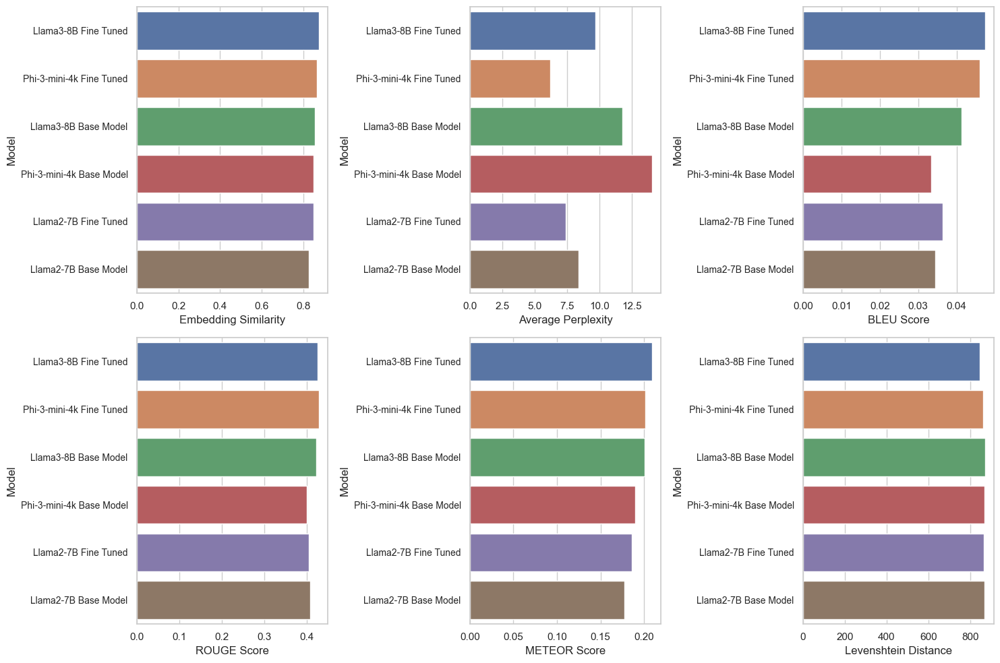
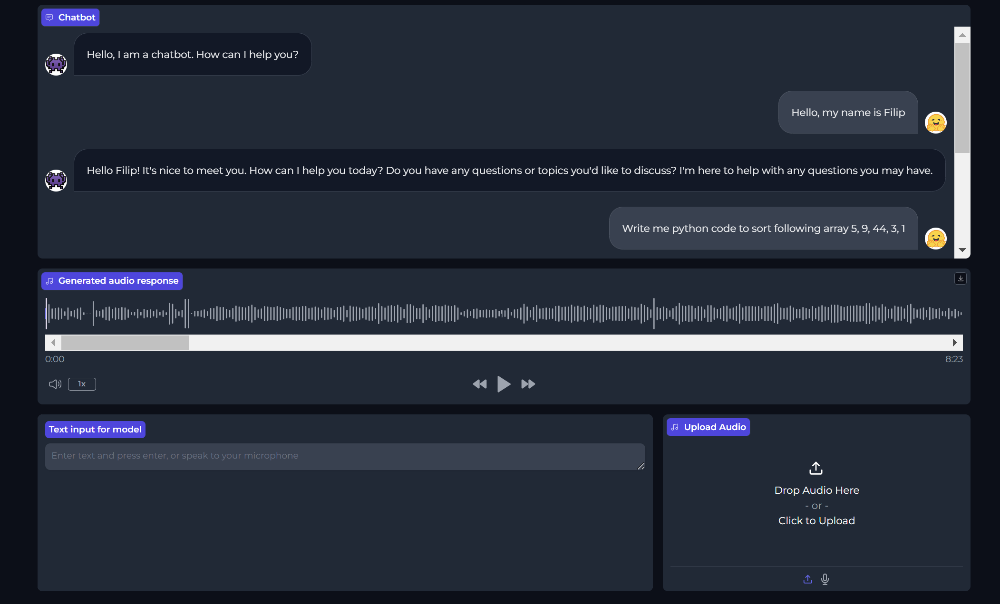
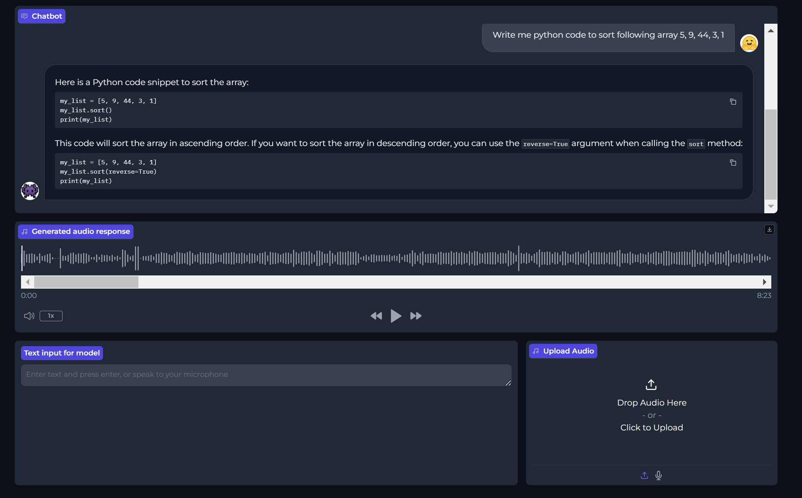

# NLPProject-OpenAssistant-Guanaco
This is a repository for the project OpenAssistant-Guanaco of the Natural Language Processing course given by prof. Carman Mark James

## Team Members

- Balice Matteo (10978268)

- Doronzo Antonio Giuseppe (11016435)

- Fabris Filip (10986123)

- Masini Alessandro (10940986)

## Project Description
Fine tuned LLMA3 8B model on the Guanaco dataset. The Guanaco dataset is a collection of 1000 dialogues between a user and a virtual assistant. The dataset is composed of 1000 dialogues, each of which is composed of 10 turns. Each turn is composed of a user message and a system response. The dataset is divided into training, validation and test set. The training set is composed of 800 dialogues, the validation set is composed of 100 dialogues and the test set is composed of 100 dialogues. The goal of the project is to fine tune the LLMA3 8B model on the Guanaco dataset and evaluate the performance of the model on the test set. The evaluation will be done by computing the BLEU score between the system responses generated by the model and the ground truth system responses in the test set.

## Conclusion

The fine-tuning of the models proved highly successful, as evidenced by the metrics we have calculated. The fine-tuned phi-3-mini-4k model was better than the base LLAMA-3-8B model in distance embedding similarity, despite having only half the parameters. The LLAMA-3-8B fine-tuned model emerged as the best model on the Guanaco dataset across various metrics:

- **Distance Embedding Similarity**, which measures the cosine similarity between the embeddings of predicted and true sentences, showed the best results for both the fine-tuned LLAMA-3-8B and phi-3-mini-4k models, with a 2% improvement across the board.
- **Perplexity**, which assesses how well the model predicts a sample, indicated that the fine-tuned phi-3-mini-4k model performed the best, with a significant average improvement of 28.23%.
- **BLEU Score**, used to evaluate the quality of machine-translated text, showed the highest results for the fine-tuned LLAMA-3-8B model.
- **ROUGE Score**, which assesses the quality of summaries or translations, also showed the best results for the fine-tuned LLAMA-3-8B model.
- **METEOR Score**, another metric for evaluating translation quality, indicated superior performance by the fine-tuned LLAMA-3-8B model.
- **Levenshtein Distance**, measuring the minimum number of operations required to transform one string into another, showed the best results for the fine-tuned LLAMA-3-8B model, with an average improvement of 12.
- **Word Error Rate (WER)**, which counts the number of errors in a transcription, showed the lowest (best) results for the fine-tuned LLAMA-3-8B model.

Another proof of the success of the fine-tuning process is demonstrated by the performance on the SQuAD dataset. In fact, the recall, which is considered the most informative metric, was higher for the fine-tuned models compared to the base models.

Despite these good improvements, the metrics could likely improve with additional epochs and greater computational power. The models were trained for about 500 epochs using Google Colab, but extending the training duration could further enhance performance.

## Gradio Application
Created a Gradio application that allows the user to interact with the fine tuned LLMA3 8B model on the Guanaco dataset. The application is composed of a text box where the user can input a message and a text box where the system response generated by the model is displayed. The user can input a message in the text box and press the submit button to get the system response generated by the model. The system response is displayed in the text box below the submit button.

## How to run the Gradio Application
It allows audio and text input and generates text output along with the audio output. 

The application is contained jupyter notebook file `gradio_app.ipynb` which can be run on Google Colab. The notebook contains the code to load the fine tuned LLMA3 8B model on the Guanaco dataset and create the Gradio application. 

It is composed inside google colab notebook because T4 GPU is required to run the model and generate the responses in a reasonable time.

## Gradio - folder structure

This document provides an overview of the folder structure for the NLP Project stored on Google Drive. It includes descriptions of the directories and the files they contain.

### Folder Overview

The main project folder is located at:
`MyDrive/NLP/Project/`

This folder contains all the necessary components for the project, including example files and model data.

### Subfolders and Files:

#### Examples Folder
* Located under:
`MyDrive/NLP/Project/examples/`

* This folder contains various example files used in the project:

  - **male.wav**: An audio file with a male voice sample.
  - **female.wav**: An audio file with a female voice sample.
  - **hf-logo.png**: The logo of Hugging Face, used in the project's UI.
  - **app_ui.png**: A screenshot or a design mockup of the application's user interface.
  - **ai-chat-logo.png**: The logo used for the AI chat component of the project.

You can download the entire project folder using: [Download](https://drive.google.com/drive/folders/1yNIIoMLkyeumj5J6PqWqLA1fMkOMn_dt?usp=sharing)

#### Model Folder
* Located under:
`MyDrive/NLP/Project/llama-8-finetuned-onlyEnglish/`

* This folder contains the `llama-8` model fine-tuned for English language tasks. Specific details about the model's configuration and training data are also included within this folder.

#### Additional Information

For more details about the project, including setup instructions or usage examples, please refer to the specific documentation files or contact the project maintainer directly - Filip Fabris.

